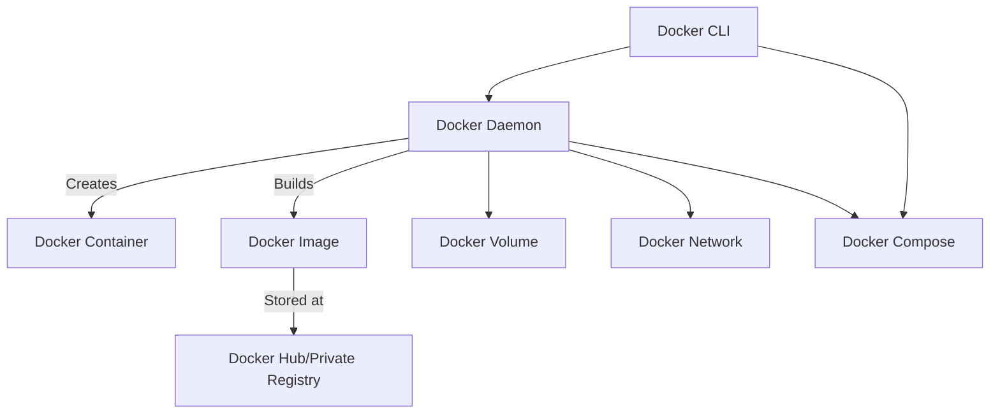

# 🐳 Docker Components

## 📦 Table of Contents

1. [Internal Components](#-internal-components)
2. [External Components](#-external-components)
3. [Supporting Tools](#-supporting-tools)
4. [Docker Architecture Diagram (Optional)](#-docker-architecture-diagram)

---

## 🔧 Internal Components

These are part of the **Docker Engine** and handle the core functionality.

| Component | Description |
|----------|-------------|
| **Docker Daemon (`dockerd`)** | Background service that manages containers, images, networks, and volumes. |
| **Docker CLI (`docker`)** | Command-line interface to interact with the Docker Daemon. |
| **Docker Images** | Read-only templates used to create containers; built from Dockerfiles. |
| **Docker Containers** | Executable units of software created from Docker images. They are isolated and lightweight. |
| **Dockerfile** | Script containing instructions to build a Docker image (e.g., `FROM`, `RUN`, `COPY`). |
| **Docker Compose** | Tool for defining and running multi-container Docker applications using YAML. |
| **Docker Volumes** | Persistent storage mechanism that allows data to persist outside of containers. |
| **Docker Networks** | Virtual networks for communication between containers. Supports bridge, host, overlay, etc. |
| **BuildKit** | A backend component used for efficient image builds (used internally in `docker build`). |

---

## 🌐 External Components

These are Docker services or related tools that exist **outside** of the local Docker Engine.

| Component | Description |
|----------|-------------|
| **Docker Hub** | Official cloud-based registry for storing and sharing Docker images. |
| **Docker Registry** | Generic term for any storage for Docker images, including private registries. |
| **Docker Desktop** | GUI application for managing Docker Engine on Windows/macOS (includes Kubernetes support). |
| **Docker Swarm** | Native clustering and orchestration tool for managing a group of Docker Engines. |
| **Docker Extensions** | Add-ons integrated with Docker Desktop for third-party tools (like Lens, Portainer, etc.). |
| **Docker Cloud (deprecated)** | Previously used for managing containers in the cloud; now integrated with Docker Hub. |

---

## 🧰 Supporting Tools

These tools complement Docker for building and managing containers:

| Tool | Description |
|------|-------------|
| **Kubernetes** | External container orchestrator; used for managing containers at scale. |
| **Minikube / Kind** | Tools to run Kubernetes locally, often with Docker. |
| **Podman** | A daemonless container engine that is compatible with Docker CLI. |
| **Skaffold** | CI/CD tool for continuous development with Kubernetes + Docker. |
| **Buildah** | A tool for building container images (alternative to `docker build`). |
| **CRIU** | Used for checkpointing and restoring running containers. |

---

## 🖼️ Docker Architecture Diagram (Optional)

> You can add a diagram like this:

---

## ✅ Summary

- Docker **internal components** form the core engine for container lifecycle.
- **External components** like Docker Hub or Kubernetes expand Docker's capabilities.
- Docker integrates seamlessly with CI/CD pipelines, registries, and orchestration tools.
